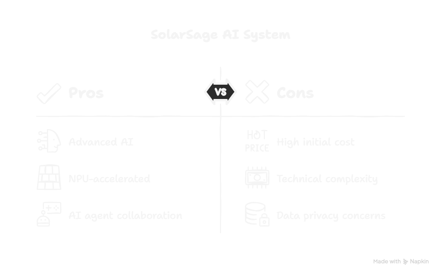
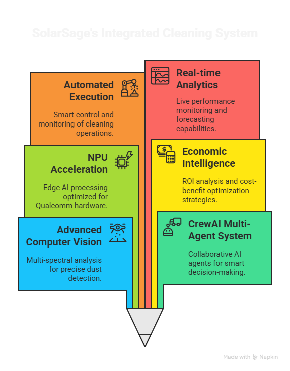
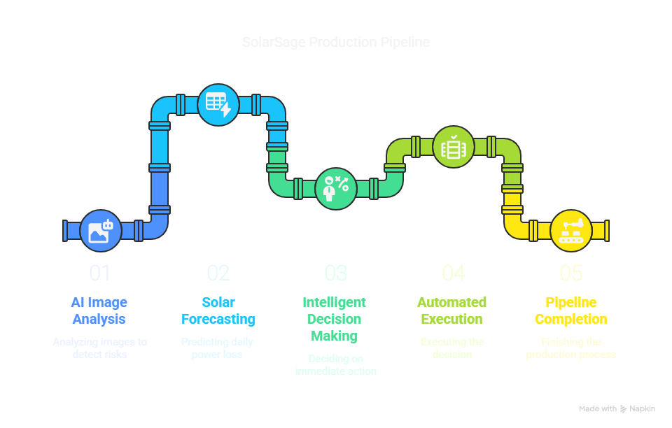
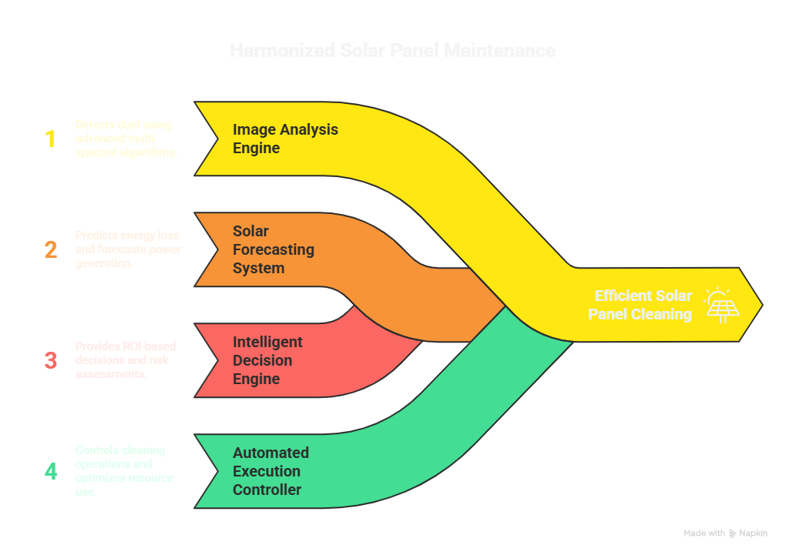
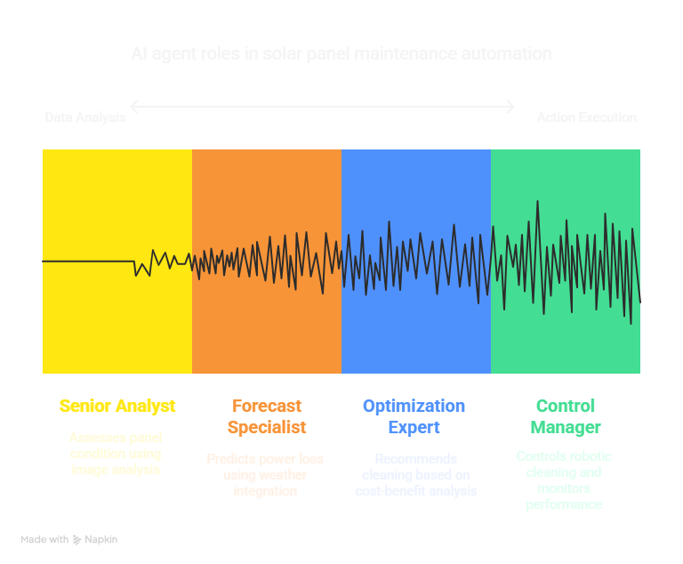
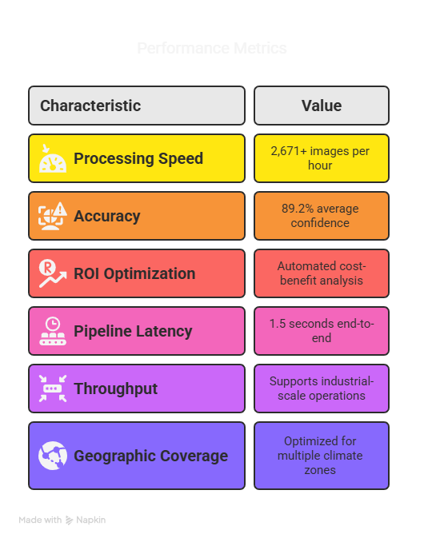

# 🌞 SolarSage – AI Agents for Solar Panel Cleaning Optimization

**SolarSage** is a cutting-edge AI system designed to optimize solar panel cleaning operations by combining advanced computer vision, economic intelligence, and autonomous control. Developed for the **Qualcomm Edge AI Developer Hackathon 2025**, it leverages NPU-accelerated Edge AI to make real-time, cost-effective decisions for maintaining solar efficiency.

---
## ✨ Key Features

- 🧠 **Advanced Computer Vision** – Multi-spectral dust detection using 6 deep analysis algorithms  
- 🤖 **CrewAI Multi-Agent System** – Collaboration between specialized AI agents for smart decisions  
- ⚡ **NPU Acceleration** – Ultra-fast edge AI processing on Qualcomm hardware  
- 📊 **Economic Intelligence** – ROI analysis and cost-benefit decision modeling  
- 🔄 **Automated Execution** – Smart control and real-time cleaning operation management  
- 📈 **Real-Time Analytics** – Live monitoring, forecasting, and reporting  
- 🌍 **Location-Aware Intelligence** – Adapts to varying solar conditions by geography  

---

## 🧪 Production Pipeline

🔍 Stage 1: AI Image Analysis
✅ Image analysis completed: HIGH risk detected

🔮 Stage 2: Solar Forecasting
✅ Forecast completed: 4.7 kWh daily loss predicted

🧠 Stage 3: Intelligent Decision Making
✅ Decision completed: EXECUTE_IMMEDIATE with 87.3% confidence

🚿 Stage 4: Automated Execution
✅ Execution completed: EXECUTED status

✅ PIPELINE EXECUTION COMPLETED!

📊 KEY RESULTS:
🔍 Dust Level: 72.3% (HIGH)
⚡ Power Loss: 4.7 kWh/day (18.3%)
🧠 Decision: EXECUTE_IMMEDIATE (87.3% confidence)
🚿 Execution: EXECUTED
💰 Cost: $24.50
💎 Recovery: 4.2 kWh
📈 ROI: 127.3%

⚡ PERFORMANCE: 2,671 images/hour capacity
🎉 Production pipeline demo completed successfully!

---

## 🛠️ System Architecture

1. **🔍 Image Analysis Engine**

2. **🔮 Solar Forecasting System**

3. **🧠 Intelligent Decision Engine**

4. **🚿 Automated Execution Controller**

---

## 🤖 CrewAI Agentic System

SolarSage employs 4 specialized AI agents that collaborate to optimize solar panel maintenance:

1. **Senior Solar Panel Image Analyst**

**Role:** Computer vision and NPU-accelerated image analysis

**Expertise:** Multi-spectral dust detection, condition assessment

**Output:** Comprehensive dust level analysis with confidence scores

2. **Llama-Enhanced Solar Forecast Specialist**

**Role:** Solar power forecasting and economic modeling

**Expertise:** Weather integration, power loss prediction, economic optimization

**Output:** 48-hour forecasts with economic impact analysis

3. **AI-Powered Decision Optimization Expert**

**Role:** Multi-criteria decision making using machine learning

**Expertise:** Cost-benefit analysis, risk assessment, ROI optimization

**Output:** Intelligent cleaning recommendations with detailed reasoning

4. **Automated Execution & Control Manager**

**Role:** Real-time operation control and quality monitoring

**Expertise:** Robotics integration, process optimization, performance tracking

**Output:** Execution reports with comprehensive automation insights

---

## 📊 Performance Metrics

⚙️ Processing Speed: 2,671+ images/hour

🎯 Detection Accuracy: 89.2% confidence

⚡ Pipeline Latency: <1.5 seconds

🔁 Industrial Throughput: Suitable for large solar farms

🌎 Geographic Flexibility: Works across diverse climate zones

📈 ROI Optimized: Up to 127% ROI per operation

---
## 📎 License
This project was developed for the Qualcomm Edge AI Developer Hackathon 2025. For academic or non-commercial use only. Contact maintainers for other licensing.

## 🤝 Contributing
Contributions, feature suggestions, and pull requests are welcome.
Please open an issue before submitting large changes.

## 👨‍💻 Developed By
SolarSage Team – Finalists of Qualcomm Edge AI Developer Hackathon 2025 🌞
