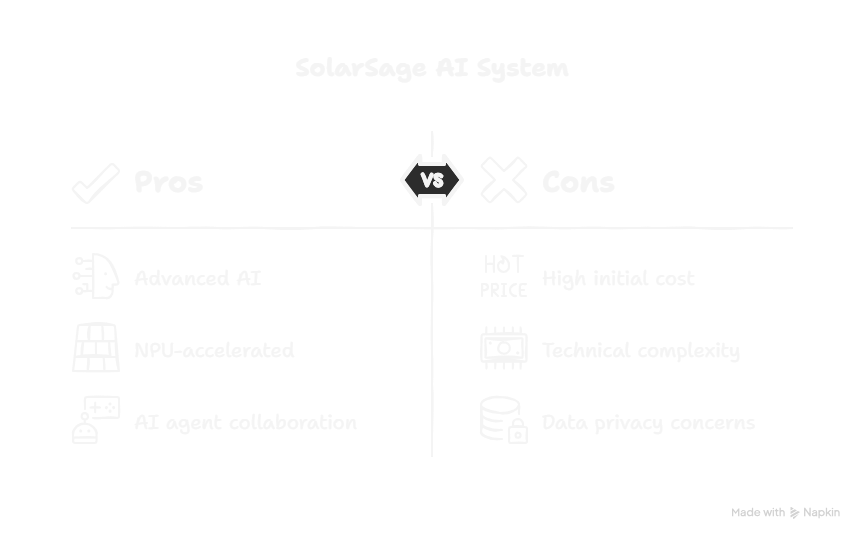
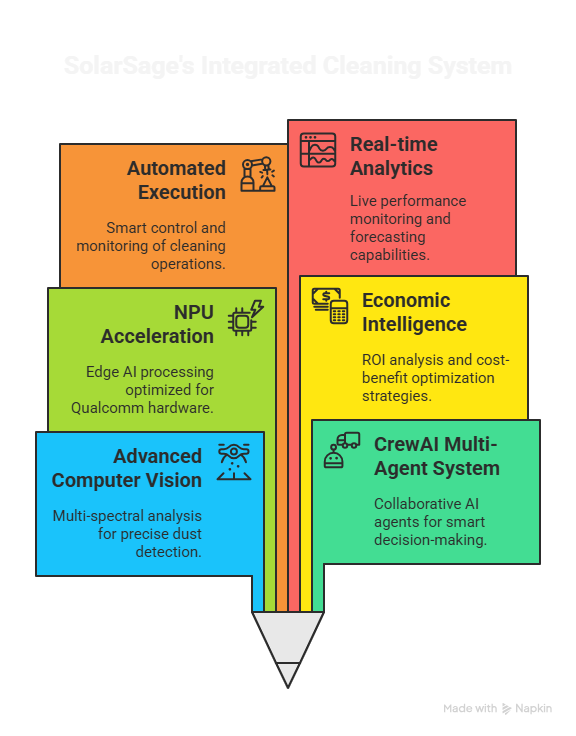
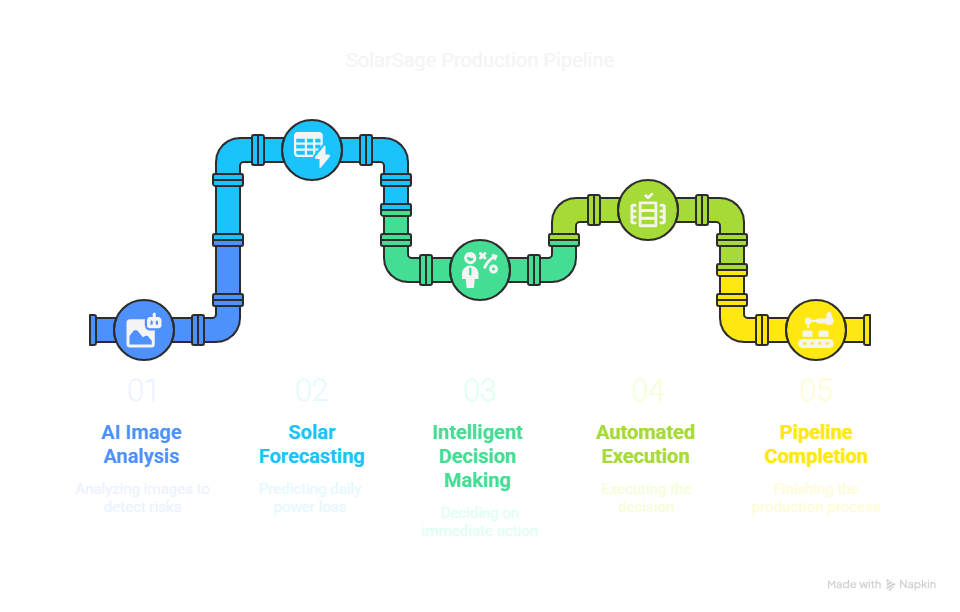
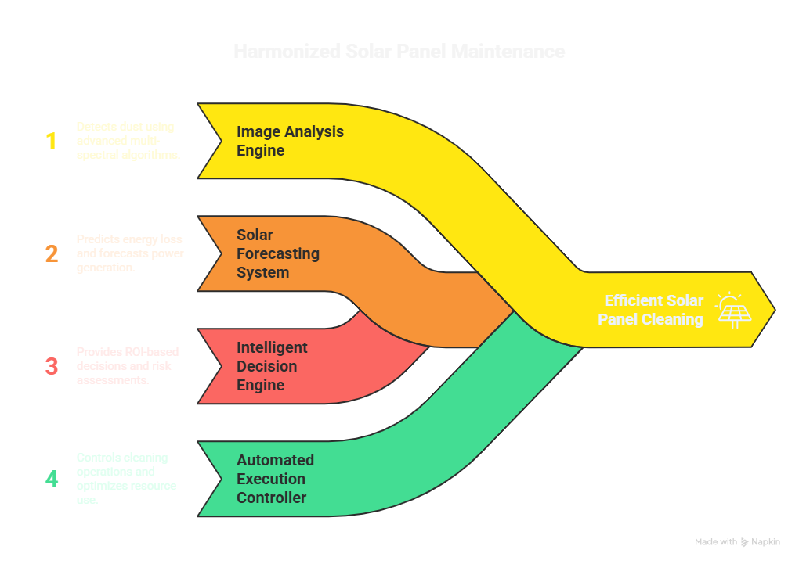
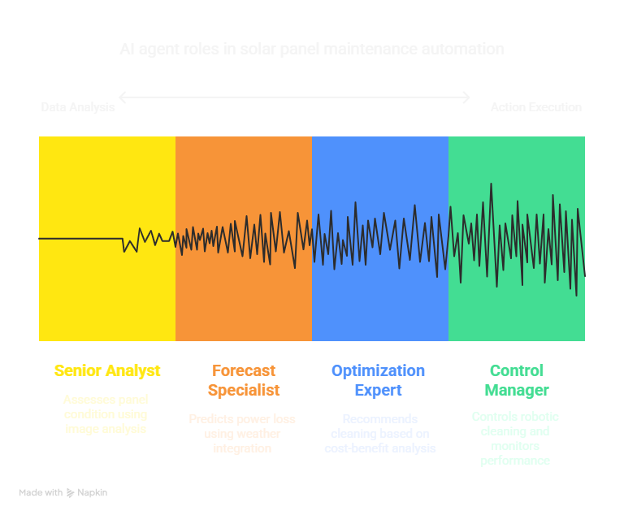
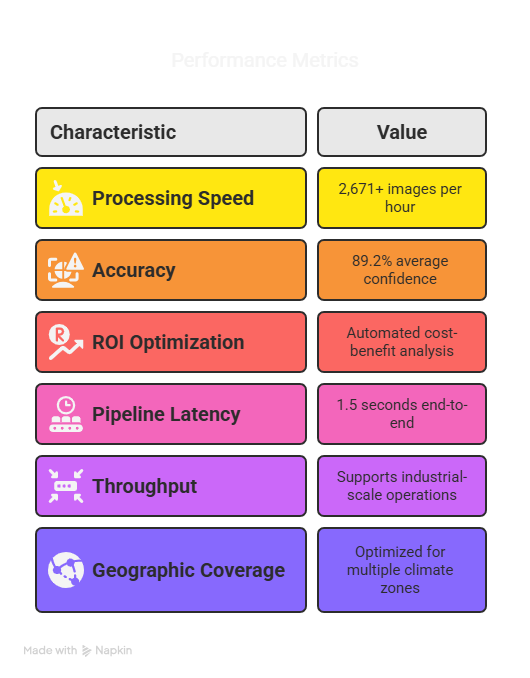

# 🌞 SolarSage – AI Agents for Solar Panel Cleaning Optimization

**SolarSage** is a cutting-edge AI system designed to optimize solar panel cleaning operations by combining advanced computer vision, economic intelligence, and autonomous control. Developed for the **Qualcomm Edge AI Developer Hackathon 2025**, it leverages NPU-accelerated Edge AI to make real-time, cost-effective decisions for maintaining solar efficiency.



---
## ✨ Key Features

- 🧠 **Advanced Computer Vision** – Multi-spectral dust detection using 6 deep analysis algorithms  
- 🤖 **CrewAI Multi-Agent System** – Collaboration between specialized AI agents for smart decisions  
- ⚡ **NPU Acceleration** – Ultra-fast edge AI processing on Qualcomm hardware  
- 📊 **Economic Intelligence** – ROI analysis and cost-benefit decision modeling  
- 🔄 **Automated Execution** – Smart control and real-time cleaning operation management  
- 📈 **Real-Time Analytics** – Live monitoring, forecasting, and reporting  
- 🌍 **Location-Aware Intelligence** – Adapts to varying solar conditions by geography  




---

## 🧪 Production Pipeline demo

🔍 Stage 1: AI Image Analysis
✅ Image analysis completed: HIGH risk detected

🔮 Stage 2: Solar Forecasting
✅ Forecast completed: 4.7 kWh daily loss predicted

🧠 Stage 3: Intelligent Decision Making
✅ Decision completed: EXECUTE_IMMEDIATE with 87.3% confidence

🚿 Stage 4: Automated Execution
✅ Execution completed: EXECUTED status

✅ PIPELINE EXECUTION COMPLETED!

📊 KEY RESULTS:
🔍- Dust Level: 72.3% (HIGH)
⚡- Power Loss: 4.7 kWh/day (18.3%)
🧠- Decision: EXECUTE_IMMEDIATE (87.3% confidence)
🚿 -Execution: EXECUTED
💰- Cost: $24.50
💎- Recovery: 4.2 kWh
📈- ROI: 127.3%

⚡ PERFORMANCE: 2,671 images/hour capacity
🎉 Production pipeline demo completed successfully!


---

## 🛠️ System Architecture

1. **🔍 Image Analysis Engine**


2. **🔮 Solar Forecasting System**


3. **🧠 Intelligent Decision Engine**

4. **🚿 Automated Execution Controller**



---

## 🤖 CrewAI Agentic System

SolarSage employs 4 specialized AI agents that collaborate to optimize solar panel maintenance:

1. **Senior Solar Panel Image Analyst**

-->**Role:** Computer vision and NPU-accelerated image analysis

-->**Expertise:** Multi-spectral dust detection, condition assessment

-->**Output:** Comprehensive dust level analysis with confidence scores

---


2. **Llama-Enhanced Solar Forecast Specialist**

-->**Role:** Solar power forecasting and economic modeling

-->**Expertise:** Weather integration, power loss prediction, economic optimization

-->**Output:** 48-hour forecasts with economic impact analysis

---


3. **AI-Powered Decision Optimization Expert**

-->**Role:** Multi-criteria decision making using machine learning

-->**Expertise:** Cost-benefit analysis, risk assessment, ROI optimization

-->**Output:** Intelligent cleaning recommendations with detailed reasoning


---

4. **Automated Execution & Control Manager**

-->**Role:** Real-time operation control and quality monitoring

-->**Expertise:** Robotics integration, process optimization, performance tracking

-->**Output:** Execution reports with comprehensive automation insights



---

## 📊 Performance Metrics

- ⚙️ Processing Speed: 2,671+ images/hour

- 🎯 Detection Accuracy: 89.2% confidence

- ⚡ Pipeline Latency: <1.5 seconds

- 🔁 Industrial Throughput: Suitable for large solar farms

- 🌎 Geographic Flexibility: Works across diverse climate zones

- 📈 ROI Optimized: Up to 127% ROI per operation


---
---

## 🗂️ Project Structure

```
├── main.py                    # ASGI entrypoint for the deployed API (Vercel)
├── run_system.py              # Local launcher: FastAPI :8000 + Next.js :3000
├── requirements.txt           # Python runtime dependencies
├── vercel.json                # Python runtime config for the API
├── .env.example               # Every backend variable, documented
├── Backend/
│   ├── services.py            # Business logic — the single source of truth
│   ├── demo.py                # Synthetic panel history for a database with no hardware behind it
│   ├── agents/
│   │   └── image_classifier.py    # Adapter onto the CV pipeline in Agents/crew.py
│   ├── api/main.py            # FastAPI: thin HTTP layer over services
│   ├── config/settings.py     # Deployment config (paths, ports, tank capacity)
│   └── database/              # SQLAlchemy models + session handling
├── web/                       # Next.js console (App Router, TypeScript)
│   ├── app/                   # Landing page, (console) route group, server actions
│   ├── components/ui/         # Design-system primitives: Pill, Card, Meter, Icon, Toast, …
│   ├── components/console/    # Dashboard, panels, reports and settings components
│   ├── components/landing/    # Hero canvas, cost curve, loop, telemetry, ledger
│   ├── lib/                   # Typed API client, demo fallback + feed, formatters, motion hooks
│   └── styles/                # The design system: core.css, console.css, landing.css
├── Agents/crew.py             # CV → forecast → decision → execution pipeline
├── Hardware/                  # ESP32 firmware, MQTT tooling, captured telemetry
└── tests/test_system.py       # End-to-end checks against a temp database
```

**How the pieces connect.** `Backend/services.py` holds every operation and every
rule — thresholds, tallies, which panels a bulk wash touches. FastAPI is a thin
HTTP layer over it, and the console renders what it returns without computing
anything of its own.

```
browser ──► Next.js (web/) ──server-side──► FastAPI (main.py) ──► Backend/services.py
                    │                                                    │
                    │                            SQLite · image fixtures · Agents/crew.py
                    │
                    └── backend unreachable ──► web/lib/demo.ts (recorded run, labelled DEMO)
```

The browser never calls the API directly: server components fetch during render
and server actions call it for mutations, so there is no CORS surface and no
API credentials in the client bundle.

Analysis flows: server action → `POST /analyze` → `services.analyze_panel` →
`Backend/agents/image_classifier` → `Agents/crew.py`
(computer vision → 48h forecast → economic decision) → SQLite.

---

## 🖥️ The interface

Two surfaces, one design system:

* **`/`** — a landing page whose numbers are read from the live system, not
  written into the copy. The hero canvas draws the four modules at their real
  measured dust coverage and runs a wash pass across them. The bundled fixtures
  put one panel in each state, so the array is never four identical readings —
  see `Backend/data/images/README.md`.
* **`/dashboard`, `/panels`, `/reports`, `/settings`** — the operator console.
  Every action is a server action: it runs on the server, reports through a
  toast, and revalidates the page so the numbers on screen come from the
  database rather than from an optimistic guess.

Colour carries meaning throughout: gold is sunlight, ochre is soiling, teal is
water, vermilion is a fault.

**One set of tokens drives both.** `web/styles/core.css` holds the whole system,
and nothing outside it invents a value:

| Token group | What it fixes |
|---|---|
| `--space-1 … --space-8` | A 4px spacing scale. Every gap, pad and margin comes from it |
| `--metric-xl / lg / md / sm` | Four sizes a number can be, applied as `.numeral--lg` etc. |
| `--micro-size`, `--micro-track`, `--eyebrow-track`, `--control-track` | One treatment for data labels, one for section eyebrows, one for controls |
| `.card` (+ `--card-pad`, `--card-tight`) | The single raised surface. Components never redeclare background, border or radius |

So a stat card, a panel card, a loop stage and a telemetry tile are the same
surface with different contents, and a page is laid out by choosing from eight
spacing values rather than typing a new decimal.

**Components, not templates.** The console is Next.js (App Router) with React
server components doing the rendering and client components only where there is
genuine interaction — a form, a dialog, a canvas, a filter. The stylesheets are
the same hand-written CSS the Jinja version used, moved across unchanged, so the
refactor changed behaviour and not a single colour.

The animation vocabulary lives in `web/lib/motion/` as hooks — `useReveal`,
`useStagger`, `useCountUp`, `useTilt`, `useMagnetic` — over
[GSAP + ScrollTrigger](https://gsap.com) for scroll choreography and
[Motion](https://motion.dev) for spring-based pointer interactions. Fonts are
self-hosted; the page makes no third-party requests.

Everything degrades: the pages are server-rendered and read normally without
JavaScript, and `prefers-reduced-motion` disables the choreography rather than
the content.

### How a screen stays current

A console page renders from one `GET /overview` call. `LiveRefresh` then asks
the router to re-render on the operator's `refresh_interval`, so the page reads
the database again and React swaps in what changed — one code path draws the
page whether it is the first paint or the twentieth refresh. A hidden tab polls
nothing.

---

## 🚀 Quick Start

Two runtimes: Python 3.11+ for the API, Node 20+ for the console.

```bash
python3 -m venv .venv && source .venv/bin/activate
pip install -r requirements.txt

cd web && npm install && cp .env.example .env.local && cd ..

python run_system.py           # API :8000 + console :3000
```

| Service | URL |
|---|---|
| Landing page | http://localhost:3000 |
| Console (dashboard) | http://localhost:3000/dashboard |
| REST API | http://localhost:8000 |
| API docs | http://localhost:8000/docs |

Run either half on its own:

```bash
python -m uvicorn Backend.api.main:app --reload      # API only
cd web && npm run dev                                # console only
```

The console reads `API_URL` from `web/.env.local`; point it at any host running
the API.

---

## ⚙️ Configuration

Deployment settings come from the environment (or a `.env` file); operational
settings are edited on the Settings page and stored in the database.

| Variable | Default | Purpose |
|---|---|---|
| `DATA_DIR` | `Backend/data` (`/tmp/solarsage` on serverless) | Writable storage for the database and decision files |
| `SQLITE_DATABASE_PATH` | `<DATA_DIR>/solar_panel_system.db` | Explicit database path |
| `API_PORT` | `8000` | Port the API listens on |
| `API_TOKEN` | unset | Shared secret. When set, every mutating route demands a matching `X-API-Key`; reads stay open |
| `CORS_ORIGINS` | `http://localhost:3000` | Comma-separated origins allowed to call the API from a browser |
| `WATER_TANK_CAPACITY_ML` | `5000` | Tank size used for water-level reporting |
| `DEMO_DATA` | `true` | Seed an empty database with synthetic panel history (see below); `false` leaves it empty |

The console has two of its own, in `web/.env.local`:

| Variable | Default | Purpose |
|---|---|---|
| `API_URL` | `http://127.0.0.1:8000` | Where the API lives. Server-side only — it never reaches the browser |
| `API_TOKEN` | unset | Must match the API's `API_TOKEN` when that is set |
| `API_TIMEOUT_MS` | `6000` | How long a read waits before the console falls back to demo data |
| `API_WRITE_TIMEOUT_MS` | `25000` | How long a write waits. Longer on purpose — a spray that timed out may still have opened the valve |

Both files are documented in full: [`.env.example`](.env.example) for the API,
[`web/.env.example`](web/.env.example) for the console. A test asserts that every
setting the code reads appears in the template, so the two cannot drift.

Runtime settings (dust thresholds, spray duration, water pressure, auto-clean,
notifications, schedule, paused/active mode) live in the `system_settings`
table and are editable from the UI.

---

## 🛟 When the backend is down

The console is a separate deployment from the API, which means the API can be
cold, redeploying, or simply gone while someone is looking at the page. None of
those may produce an error screen, so the read path has one rule: **a backend
that does not answer is a state to render, not an exception to throw.**

```
page (server component)
   └─ overviewFeed()            web/lib/feed.ts
        ├─ getOverview()  ──►  FastAPI            → { source: "live" }
        └─ on failure     ──►  web/lib/demo.ts    → { source: "demo", reason }
```

Three states, and the screen always says which one it is in:

| State | What happened | What the operator sees |
|---|---|---|
| **Live** | The API answered | `● LIVE DATA` in the rail, no banner |
| **Live, seeded** | The API answered, but its database was filled by `Backend/demo.py` rather than by hardware | `● LIVE DATA`, plus the amber *Synthetic data* banner |
| **Demo** | The API refused, timed out, or errored | `● DEMO DATA`, plus a red *Backend unavailable* banner naming the cause |

Demo data is never presented as live. The distinction is carried explicitly in
`source`, not inferred from the shape of the data, so no component downstream has
to guess — and `demo_seeded_at` (a fact about the live database) stays separate
from the fallback (a fact about reachability).

**What the fallback is.** `web/lib/demo.ts` is a transcript of a real pipeline
run against the panel image fixtures: the dust levels are what the classifier
scored, the decision and its economics are what the decision engine returned,
and the telemetry rows come from a recorded ESP32 capture in `Hardware/`. The
tallies are counted off the panel list rather than typed beside it and the water
spent is the wash count times the spray volume, so the numbers survive being
added up. Tests in `web/lib/__tests__/feed.test.ts` assert exactly that.

**Recovery is automatic.** A degraded page keeps its refresh timer running, so
each tick re-attempts the fetch — a backend that was merely cold-starting brings
the console back to live data with nobody reloading anything.

**Writes are never faked.** Actions still call the API while degraded and report
the real failure through a toast. Nothing reports success for a valve that did
not open.

---

## 🔒 Security posture

There are no user accounts: the console is meant for a trusted operator, not a
public sign-up. Within that, the parts that can act are guarded:

* **Writes need a shared secret.** The API is reachable from anywhere once
  deployed and its POST routes open a valve, so set `API_TOKEN` on both
  deployments. Every mutating route then demands a matching `X-API-Key`; reads
  stay open. Left unset the API is open, which is fine on a laptop and not fine
  in front of a pump.
* **The browser never holds a credential.** Pages fetch through server
  components and mutate through server actions, so `API_URL` and `API_TOKEN`
  live only on the console's server.
* Panel ids are validated in `Backend/services.py` before they reach the
  filesystem or the database — every entry point routes through that one check,
  and an unknown panel is a 404 rather than a 200 with an error inside it.
* Settings are range- and type-checked on the way in: a refresh interval
  becomes a browser timer and a spray duration becomes pump seconds, so neither
  is stored unvalidated.
* `CORS_ORIGINS` decides who may call the API from a browser; it defaults to
  localhost, not to `*`.
* No secret has ever been committed. The `.env` that appears in this repository's
  history held paths, a LAN broker address and thresholds — no keys, no
  passwords, nothing to rotate. `.gitignore` excludes `.env*` while keeping the
  `.env.example` templates.
* Errors are classified before they reach a screen (`ApiError.kind`:
  `TIMEOUT`, `NETWORK_ERROR`, `AUTH_ERROR`, `VALIDATION_ERROR`, `NOT_FOUND`,
  `SERVER_ERROR`). The operator gets a sentence; the cause goes to the server
  log. A backend stack trace is never rendered.

---

## 🧪 Testing

```bash
pip install -r requirements-dev.txt
python tests/test_system.py    # the system: pipeline, rules, API

cd web && npm test             # the console's own logic
npx tsc --noEmit               # …and its types
```

The Python suite covers the CV pipeline against the bundled image fixtures,
threshold-driven decisions, auto-clean gating, water-tank and pause guards,
the demo seeding, hardware telemetry parsing, the aggregates and bulk
operations, and every FastAPI route including the token guard. It runs against a
temporary database and never touches the real one.

The console's tests cover what the console itself decides: formatting a reading
that might be null, the table that maps a panel state to its label, colour and
next step, and the fallback path — that an unreachable backend yields a populated
console marked `demo` rather than an error, that failures are classified into the
kinds the UI branches on, and that the demo dataset's own arithmetic holds (its
tallies sum to the panel count, its water spent equals wash count times spray
volume, and nothing in it is non-finite). Everything else it renders is a rule
that lives in Python, where it already has tests.

Two of the Python tests exist only to protect the deployment: one asserts the
root `main.py` entrypoint serves every route, the other that `vercel.json` names
a file that exists and carries no path-replacing rewrite. Both encode the bug
that made the deployed API 404 on everything.

---

## 🔌 API Reference

| Method | Endpoint | Description |
|---|---|---|
| `GET` | `/health` | Water level, camera status, temperature from telemetry |
| `GET` | `/panels` | All panels with status, dust level and last cleaning |
| `GET` | `/panels/{id}/history` | Analysis and cleaning history |
| `GET` | `/panels/{id}/detail` | Current state, history and the panel's sensor node |
| `GET` | `/overview` | Health, panels, tallies, stats, newest decision and settings in one call |
| `POST` | `/panels/analyze-all` | Analyse every panel, reporting per-panel failures |
| `POST` | `/panels/spray` | Bulk wash — `{"scope": "dirty"}` or `{"scope": "all"}` |
| `POST` | `/analyze` | Run the CV + forecast + decision pipeline for a panel |
| `POST` | `/spray` | Execute a cleaning cycle |
| `GET` | `/latest-decision` | Most recent decision with its economic analysis |
| `GET` | `/system/stats` | Totals, average dust level, water usage, uptime |
| `GET` | `/system/logs` | Recent system log entries |
| `GET`/`PUT` | `/settings` | Read or update runtime settings |
| `POST` | `/settings/reset` | Restore default settings |
| `POST` | `/system/refill-tank` | Reset the water-tank counter |
| `GET` | `/hardware/telemetry` | Latest ESP32 capture from `Hardware/` |

---

## ☁️ Deployment (Vercel)

| | URL |
|---|---|
| **Console** (start here) | **https://solarsage-console.vercel.app** |
| API | https://solarsage-ai.vercel.app |
| API docs | https://solarsage-ai.vercel.app/docs |

Two Vercel projects from this one repository, because they are two runtimes.
Both deploy from `main`, and either can be redeployed without the other.

| Project | Root directory | Framework | Serves |
|---|---|---|---|
| `solarsage-ai` | `.` | FastAPI (Python) | `main.py` → the whole ASGI app |
| `solarsage-console` | `web` | Next.js | The landing page and the console |

**Why this split.** The console is a Next.js app and belongs on a platform that
runs the App Router natively; the API is an ASGI app that Vercel's Python runtime
serves as-is, with no rewrite rules and no container to maintain. Both fit the
free Hobby tier, both get HTTPS and a git-push deploy, and neither needs a
credential from a third party. Keeping them separate means a backend redeploy
cannot take the demo down: the console degrades and keeps serving (see
[When the backend is down](#-when-the-backend-is-down)).

Both projects run in `bom1`, so the console's server-side call to the API stays
in one region instead of crossing an ocean on every render.

### The entrypoint matters

`main.py` sits at the repository root, not under `api/`. A module under `api/` is
treated as one function bound to its own path, so a catch-all rewrite is needed
to reach it — and that rewrite **replaces the request path**, which means FastAPI
receives `/api/index` instead of `/health` and every route 404s. A root-level
`main.py` is served for every path with no rewrite at all.
`tests/test_system.py` asserts both halves of this so it cannot regress.

### Deploying from scratch

```bash
npm i -g vercel

# 1. the API  (repository root)
vercel link                                    # root directory: .
vercel env add API_TOKEN production            # python -c "import secrets;print(secrets.token_urlsafe(32))"
vercel --prod

# 2. the console
cd web
vercel link                                    # root directory: web
vercel env add API_URL production              # https://<the API deployment>
vercel env add API_TOKEN production            # the SAME secret as above
vercel --prod
```

`API_TOKEN` must match on both sides. Set it: with it unset the API accepts
anonymous writes, and anyone who can reach the URL can open a valve.

`DATA_DIR` needs no configuration — it defaults to `/tmp/solarsage` whenever the
`VERCEL` environment variable is present, because serverless filesystems are
read-only apart from `/tmp`.

**Storage caveat.** `/tmp` is per-instance and cleared when an instance recycles,
so the deployed database is ephemeral: a settings change or a wash you trigger
survives until that instance is replaced, not indefinitely. That is a deliberate
trade — it keeps the project free and dependency-free — and it is honest on
screen, because a fresh instance re-seeds and labels itself synthetic. Point
`SQLITE_DATABASE_PATH` at persistent storage, or move to Postgres, for a real
deployment.

**Synthetic data when there is no hardware.** Because that database starts empty
on every cold start, `Backend/demo.py` seeds it the first time it comes up — it
runs the real classifier over the four image fixtures, then back-fills the wash
and the readings taken since for each panel. Nothing is fabricated: the dust
levels, forecasts and economics are what the pipeline reports for those frames.
Seeded databases record a `demo_seeded_at` setting and every console page carries
a banner saying so. `DEMO_DATA=false` disables it; the seed is a no-op once any
real analysis exists.

---

## 🧭 Known limitations

* **Ephemeral storage on the free tier.** As above: writes live in `/tmp` and do
  not survive an instance recycle. Fine for a demo, not for an installation.
* **`/docs` and `/openapi.json` are public.** Deliberate — the API is a portfolio
  artefact and the schema is worth reading. Close them for a real deployment.
* **Process uptime, not system uptime.** The dashboard's uptime figure is how
  long the current process has run, which on serverless is near zero. It is
  labelled *Process uptime* rather than dressed up as something else.
* **No user accounts.** Access is one shared `API_TOKEN` for writes; reads are
  open. Enough for a single-operator console, not a multi-tenant product.
* **Hardware telemetry is replayed, not streamed.** The ESP32 captures in
  `Hardware/` are read from disk. Live MQTT ingestion is wired in the firmware
  but not in the deployed API.
* **CV is classical, not learned.** Dust scoring is OpenCV texture/contrast
  analysis, which is deterministic and fast but not a trained model.

---

## 📎 License
This project was developed for the Qualcomm Edge AI Developer Hackathon 2025. For academic or non-commercial use only. Contact maintainers for other licensing.

## 🤝 Contributing
Contributions, feature suggestions, and pull requests are welcome.
Please open an issue before submitting large changes.

## 👨‍💻 Developed By
SolarSage Team – Finalists of Qualcomm Edge AI Developer Hackathon 2025 🌞
